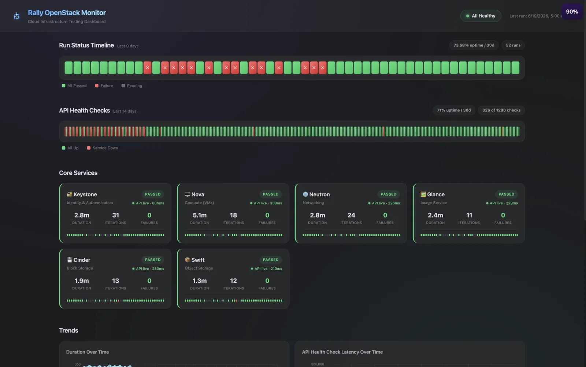

維運 OpenStack 一段時間後，其實最讓我不安的不是節點掛掉，而是「節點看起來都好好的，但使用者就是開不了 VM」。傳統的 node-level 監控（CPU、記憶體、磁碟）只能告訴你機器還活著，卻沒辦法回答最關鍵的問題：現在從使用者的角度看，這朵雲到底還能不能用？

於是我就做了一套東西來持續回答這個問題，跑在 [stats.cloudnative.tw](https://stats.cloudnative.tw) 上。本篇文章會來介紹這套 [openstack-rally-monitor](https://github.com/ching-kuo/openstack-rally-monitor) 的設計，以及過程中踩到的一些坑。



<!-- truncate -->

## 為什麼是 Rally

要從使用者角度驗證雲端，最直接的方法就是真的去打 API：建一個 user、開一台 server、掛一顆 volume，看會不會成功。這種 black-box 的測法，OpenStack 社群其實早就有官方工具了，就是 [Rally](https://github.com/openstack/rally)。

Rally 顧名思義是拿來做 benchmarking 跟壓力測試的，但它的 scenario 機制剛好也很適合拿來做健康檢查。每個 scenario 就是一連串對 API 的操作，跑完還會自動把建立的資源清掉，並且依照 SLA（例如 `failure_rate` 必須為 0）判定這次 task 算 pass 還是 fail。

以 Keystone 為例，scenario 大概長這樣：

```yaml
KeystoneBasic.create_delete_user:
  -
    runner:
      type: constant
      times: 5
      concurrency: 2
    sla:
      failure_rate:
        max: 0
```

意思是用 concurrency 2 連續跑 5 次「建立並刪除 user」，只要有任何一次失敗，這個 scenario 的 SLA 就算 breach。目前監控的服務有六個：Keystone、Nova、Neutron、Glance、Cinder、Swift，每個都有對應的 scenario YAML。

## 整體架構

整套東西其實就是一個 Docker container，裡面由 cron 排程，跑三個並行的 process：

| Process | Port | 做什麼 |
|---------|------|--------|
| Rally task 執行 | — | cron 排程，預設每 4 小時跑一輪完整測試 |
| `rally_exporter.py` | `9101` | Flask app，讀 `/results/` 的 JSON，吐出 Prometheus metrics |
| Dashboard (`serve.py`) | `8080` | 靜態 dashboard，把測試結果畫成時間軸跟延遲圖表 |

Rally 跑完會把結果寫成 JSON 丟到 `/results/`，exporter 再從那些檔案產生 metrics 給 Prometheus 抓，dashboard 則直接讀同一份結果來呈現。三個 process 之間完全靠檔案系統溝通，沒有額外的 DB，這樣壞掉的時候也好 debug。

## Dashboard

對使用者來說，最直接會看到的就是 [stats.cloudnative.tw](https://stats.cloudnative.tw) 上的 dashboard。它是個 dark-theme 的靜態頁面，把上面那些測試結果畫成幾個區塊：


- **7 天狀態時間軸**：一眼看出各服務最近幾天有沒有出過狀況。
- **延遲圖表**：每個服務 API 的回應時間變化。
- **uptime 百分比**：API 與 smoke test 在預設 30 天視窗內的可用率。
- **失敗原因**：哪個 scenario 失敗、為什麼失敗，直接列在上面。

頁面會自己 auto-refresh，正在跑測試的時候上面還會有個 "test run in progress" 的指示。想知道現在 Infra Labs 的雲到底能不能用，打開這頁看一眼大概就有底了。

時間軸上方還有一塊公告橫幅，維運者可以推播三種公告：incident（紅，服務出狀況時）、maintenance（黃，預定維護期間）、scheduled（藍，預告未來的維護時段）。這樣使用者看到測試變紅的時候，可以直接從橫幅知道是真的壞了、還是我們正在維護，不用自己猜。

## 兩段式的檢查節奏

一開始我只有跑 Rally，但很快就發現一個問題：完整的 Rally task 蠻重的，跑一輪要好幾分鐘，所以排程不能太密，預設是 4 小時一次。可是如果某個服務在第 1 分鐘就掛了，最糟要等快 4 小時才會被測到，這個延遲對告警來說太長了。

於是後來加了第二段更輕量的檢查：每 15 分鐘做一次唯讀的 API health check。它不建立任何資源，只用單一一個 authenticated session（一個 cycle 一個 token）去打各服務的 list API，量一下 round-trip 時間。這樣一來：

- **重的 Rally task**（4 小時）負責驗證「完整的 CRUD 流程」真的能跑完，並檢查資源有沒有正確清掉。
- **輕的 health check**（15 分鐘）負責快速抓到「服務不可達」這種大問題。

health check 還有一個 `degraded` 狀態：服務有回應、但延遲超過 `HEALTH_LATENCY_WARN_MS`（預設 5000ms）就標成 degraded。注意 degraded 在可達性上仍算 up，慢這件事是反映在 `rally_api_latency_milliseconds` 這個 metric，要對延遲告警就針對它來設。

## 真正麻煩的是清理失敗

如果只是「測 API 通不通」，這專案大概兩天就寫完了。實際上花最多時間的，反而是處理 Rally 自己留下來的垃圾。

Rally 在 scenario 跑完後會嘗試清理它建立的資源，但清理是有可能失敗的，失敗了就會在 OpenStack 裡留下 orphaned resources。對一個長期跑的監控來說，這些垃圾會越積越多，最後可能反過來把 quota 吃光、害正常測試也失敗。

更微妙的是，orphan 其實有兩種，而且嚴重程度不一樣：

| Prefix | 由誰建立 | 何時殘留 | 嚴重程度 |
|--------|---------|---------|---------|
| `s_rally_*` | scenario plugin | 測試**進行中**清理失敗 | critical / warning |
| `c_rally_*` | context plugin（user、project、network） | task 判定 pass **之後**才 teardown 失敗 | info |

這裡有個容易踩的坑：Rally 判定 task 是不是 pass，是看 scenario 的成功率，而 context 的 teardown 是在結果記錄**之後**才跑的。也就是說，一個 task 完全可以顯示 passed，背後卻留了一堆 `c_rally_*` 沒清乾淨。task 狀態完全看不出來。所以我把這兩種 prefix 分開偵測、分開標示嚴重程度：`s_rally_*` 算 critical（測到一半就壞了），`c_rally_*` 只當 info（功能正常，只是收尾沒收好）。

### Ceph RGW 的隱藏 orphan

還有一個更隱蔽的。我們的 Ceph 開了 `rgw_keystone_implicit_tenants=true`，這個設定會讓每個 Keystone project 自動對應一個 RGW user。問題是 Rally 每輪測試都在建立、刪除 Keystone project，但它**只管 OpenStack 這邊**，RGW 那側自動長出來的 user 它根本不知道，於是 Ceph 裡就累積一堆孤兒 user 跟 bucket。

這個只能自己處理。run_tests.sh 每輪跑完會去 RGW admin API 比對，把 Rally 自己造成的 orphan 清掉。這裡有個安全考量：清理必須 **fail-closed**，也就是只刪「確定是 Rally 建立」的資源——project ID 要出現在 provenance ledger（`/results/rally_project_ids.log`）裡才會動它，非 Rally 的 orphan 一律不碰。如果掃描出錯或 Keystone 查詢結果不明確，寧可不刪、把 scan 狀態標成 degraded，也不要冒險誤刪到別人的東西。

## 小結

這套監控的核心想法其實很單純：與其猜雲端健不健康，不如真的用使用者的方式去打一遍 API。Rally 提供了現成的 scenario 機制，剩下的工程量大多花在「測試之外」的地方——兩段式的檢查節奏、orphan 的分類與清理，以及把結果整理成一眼就看得懂的 dashboard。

如果你也在維運 OpenStack，想知道現在到底能不能開 VM 而不是只盯著 Grafana 上的 CPU 曲線，可以參考看看這套做法。專案是 MIT 授權，歡迎拿去改成適合自己 cloud 的樣子。

## Reference

- [openstack-rally-monitor (GitHub)](https://github.com/ching-kuo/openstack-rally-monitor)
- [Infra Labs 監控儀表板](https://stats.cloudnative.tw)
- [OpenStack Rally](https://github.com/openstack/rally)
